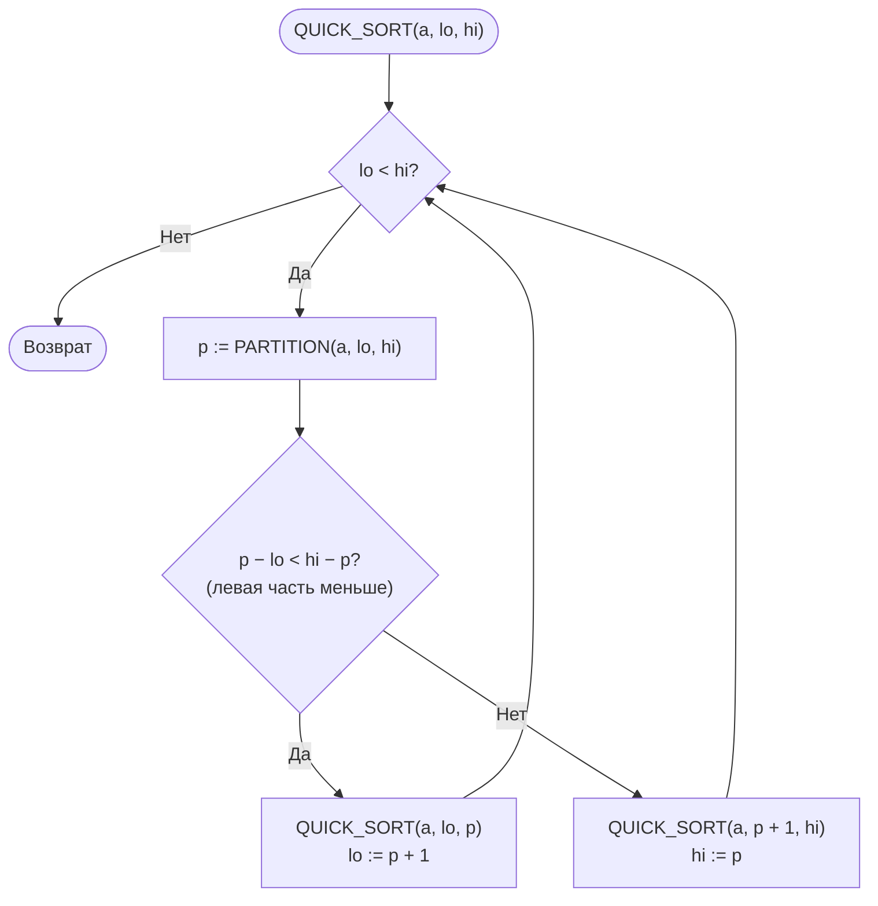
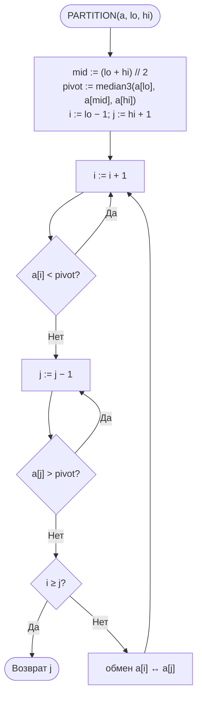
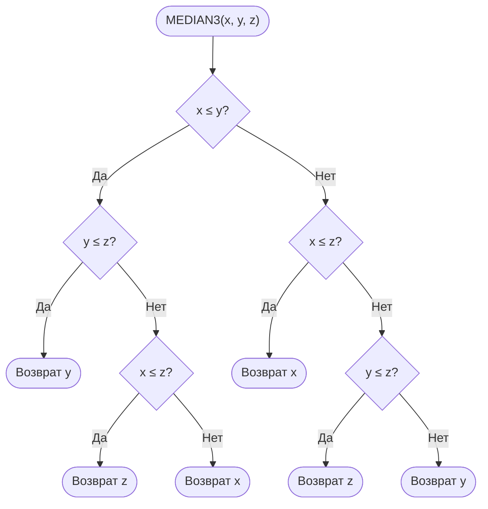
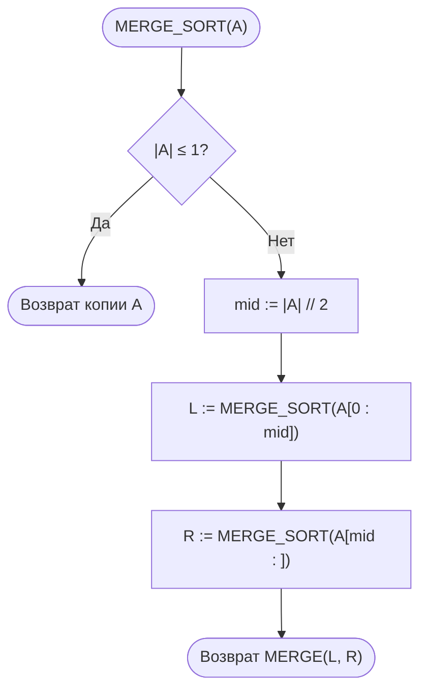
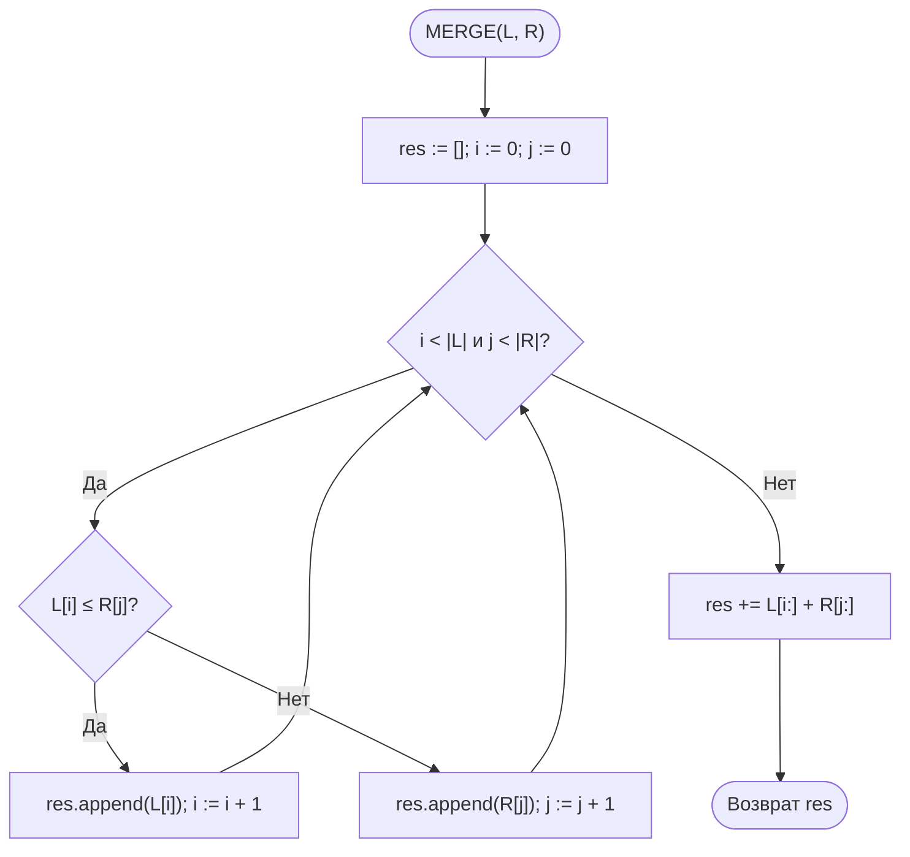

# Лабораторная работа № 3

## Эмпирический анализ временной сложности алгоритмов сортировки. Часть 2: алгоритмы на основе парадигмы «разделяй и властвуй» (быстрая сортировка и сортировка слиянием)

**Дисциплина:** Теория алгоритмов
**Направление подготовки:** 38.03.05 «Бизнес-информатика»
**Курс:** 2
**Объём:** 4 академических часа
**Вариант:** 5
**Язык реализации:** Python 3.10+
**Предварительные требования:** выполненная ЛР № 2 (функции `bubble_sort`, `insertion_sort`, модуль `sorts_common.py`)

---

## 1. Цель и задачи работы

**Цель работы:** изучить рекурсивные алгоритмы сортировки, построенные по принципу «разделяй и властвуй», экспериментально подтвердить их сложность $O(n \log n)$ и провести сравнительный анализ с квадратичными алгоритмами из ЛР № 2.

**Задачи:**

1. Изучить парадигму «разделяй и властвуй» и метод анализа рекуррентных соотношений.
2. Реализовать быструю сортировку (Quick Sort) и сортировку слиянием (Merge Sort) согласно варианту.
3. Сравнить четыре алгоритма (пузырьком, вставками, быструю, слиянием) на размерах из варианта ЛР № 2.
4. Сравнить быструю сортировку и сортировку слиянием между собой на больших массивах и на данных различной структуры, используя `sorted()` как эталон.
5. Исследовать влияние выбора опорного элемента на производительность быстрой сортировки.
6. Выполнить дополнительное задание **Г5** — продемонстрировать устойчивость/неустойчивость алгоритмов на записях вида `(регион, выручка)`.

---

## 2. Задание своего варианта

**Исходные данные (вариант 5, табл. 2 методических указаний):**

| Параметр | Значение |
|---|---|
| Опорный элемент | **М3** — медиана трёх (первый, средний, последний) |
| Схема разбиения | **Х** — Хоара |
| Сортировка слиянием | **Н** — нисходящая (рекурсивная) |
| Размеры $n$ для эксперимента 2 | 30 000; 60 000; 90 000; 120 000 |
| Дополнительное задание | **Г5** |

**Параметры экспериментов:**

| Эксперимент | Содержание | Данные | Повторов $k$ |
|---|---|---|---|
| 1 | Четыре алгоритма на размерах из варианта ЛР № 2: $n = 1000, 2000, 3000, 4000, 5000, 6000$ | 1а — упорядоченные (тип S из ЛР № 2), $[0;100\,000]$; 1б — случайные, $[0;100\,000]$ | 3 |
| 2 | Быстрая, слиянием, `sorted()` на больших $n$ | случайные, $[0;100\,000]$ | 3 |
| 3 | Быстрая и слиянием на данных R, S, V, N, D | $n = 50\,000$ | 3 |

**Особенность варианта.** Комбинация **М3 + Х (Хоар)** — одна из наиболее устойчивых стратегий быстрой сортировки:

- **медиана трёх** защищает от вырождения на упорядоченных и обратно упорядоченных данных: опорный элемент оказывается близок к истинной медиане, разбиения получаются сбалансированными (размеры частей $\approx n/2$), и быстрая сортировка сохраняет сложность $\Theta(n\log n)$ на **всех** типах входных данных, включая S и V;
- **схема Хоара** выполняет меньше обменов, чем Ломуто, и лучше справляется с массивами, содержащими большое число повторяющихся ключей (тип D).

Поэтому, в отличие от варианта 14 (опорный — последний, Ломуто), в варианте 5 ограничение $n \le 3000$ для структурированных данных **не требуется**: эксперимент 3 выполняется при полноценном $n = 50\,000$.

**Формулировка Г5:** продемонстрировать устойчивость/неустойчивость алгоритмов на записях вида `(регион, выручка)`, отсортированных по выручке; сделать вывод о пригодности алгоритмов для многоуровневой сортировки отчётов.

---

## 3. Теоретическая часть

### 3.1. Парадигма «разделяй и властвуй»

Решение задачи в три этапа: **разделение** на подзадачи меньшего размера, **властвование** (рекурсивное решение подзадач; малые решаются непосредственно — базовый случай) и **комбинирование** решений. Трудоёмкость описывается рекуррентностью

$$T(n) = a \cdot T\!\left(\frac{n}{b}\right) + f(n).$$

При $a=b=2$, $f(n)=\Theta(n)$ по основной теореме $T(n)=\Theta(n\log n)$: дерево рекурсии имеет $\approx\log_2 n$ уровней, на каждом суммарно выполняется $\Theta(n)$ операций.

### 3.2. Нижняя оценка для сортировок сравнением

Любая сортировка сравнением в худшем случае выполняет $\Omega(n\log n)$ сравнений: дерево решений должно иметь не менее $n!$ листьев, поэтому его высота не меньше $\log_2(n!) = \Theta(n\log n)$. Значит, сортировка слиянием асимптотически оптимальна.

### 3.3. Сортировка слиянием (нисходящая, Н)

- **Разделение:** массив делится пополам.
- **Властвование:** половины сортируются рекурсивно; массив из 0 или 1 элемента упорядочен.
- **Комбинирование:** две упорядоченные половины сливаются за $\Theta(n)$; нестрогое сравнение `left[i] <= right[j]` обеспечивает устойчивость.

```
MERGE-SORT(A)
1  if |A| ≤ 1
2      return A
3  mid = ⌊|A| / 2⌋
4  L = MERGE-SORT(A[1..mid])
5  R = MERGE-SORT(A[mid+1..n])
6  return MERGE(L, R)
```

Рекуррентность одинакова во **всех** случаях:

$$T(n) = 2T(n/2) + \Theta(n) \;\Rightarrow\; T(n) = \Theta(n\log n).$$

Недостаток — $\Theta(n)$ дополнительной памяти. Сортировка слиянием **устойчива**.

### 3.4. Быстрая сортировка: медиана трёх, разбиение Хоара

- **Выбор опорного элемента (М3):** из трёх кандидатов — $A[lo]$, $A[mid]$, $A[hi]$ — выбирается **медиана** (средний по величине). Это защищает от худшего случая на упорядоченных и обратно упорядоченных массивах.
- **Разбиение (Хоара, Х):** два указателя $i$ и $j$ движутся навстречу друг другу; $i$ ищет элемент $\ge$ опорного, $j$ — элемент $\le$ опорного; найденные элементы обмениваются. Когда указатели встречаются, возвращается индекс $j$ — граница раздела.

```
PARTITION-HOARE(A, lo, hi)
1  pivot = медиана(A[lo], A[mid], A[hi])
2  i = lo − 1; j = hi + 1
3  while true
4      repeat i = i + 1 until A[i] ≥ pivot
5      repeat j = j − 1 until A[j] ≤ pivot
6      if i ≥ j
7          return j
8      обменять A[i] и A[j]
```

**Оценки:**

- лучший и средний случаи: $T(n) = 2T(n/2)+\Theta(n) = \Theta(n\log n)$;
- худший случай: $T(n) = T(n-1)+\Theta(n) = \Theta(n^2)$ — но при медиане трёх он практически не реализуется (требуется специально подобранная «антимедианная» последовательность);
- **устойчивость:** нет. Обмены элементов через большие расстояния могут изменить взаимный порядок равных ключей.

**Глубина рекурсии.** В реализации рекурсивно обрабатывается **меньшая** часть, а большая — в цикле, поэтому глубина стека $O(\log n)$ даже в худшем случае. Без этого приёма на упорядоченных данных (в варианте с опорным «последний» или «первый») глубина достигла бы $n$, и Python завершился бы с `RecursionError`. В варианте 5 (М3) этого не происходит и без приёма, но он всё равно полезен как страховка.

### 3.5. Сводная характеристика

| Алгоритм | Лучший | Средний | Худший | Доп. память | Устойчивость |
|---|---|---|---|---|---|
| Пузырьком | $\Theta(n)$ | $\Theta(n^2)$ | $\Theta(n^2)$ | $O(1)$ | Да |
| Вставками | $\Theta(n)$ | $\Theta(n^2)$ | $\Theta(n^2)$ | $O(1)$ | Да |
| Слиянием (Н) | $\Theta(n\log n)$ | $\Theta(n\log n)$ | $\Theta(n\log n)$ | $\Theta(n)$ | Да |
| Быстрая (М3, Хоар) | $\Theta(n\log n)$ | $\Theta(n\log n)$ | $\Theta(n\log n)$ (практически) | $O(\log n)$ | **Нет** |
| Timsort (`sorted`) | $\Theta(n)$ | $\Theta(n\log n)$ | $\Theta(n\log n)$ | $O(n)$ | Да |

---

## 4. Блок-схемы алгоритмов

### 4.1. Быстрая сортировка



### 4.2. Разбиение Хоара с медианой трёх (М3)





### 4.3. Сортировка слиянием (нисходящая) и слияние





### 4.4. Дерево рекурсии

Для сортировки слиянием при $n=8$: 4 уровня (размеры $8 \to 4+4 \to 2+2+2+2 \to 1\times 8$), на каждом уровне слияния суммарно $\Theta(n)$ операций, откуда $T(n)=\Theta(n\log_2 n)$.

Для быстрой сортировки с медианой трёх (М3) на **любом** массиве дерево рекурсии остаётся сбалансированным: опорный близок к истинной медиане, части имеют размеры $\approx n/2$, высота $\approx \log_2 n$, что даёт $\Theta(n\log n)$.

---

## 5. Листинг программы

Модуль `lr3.py` (используются `sorts_common.py` и `lr2.py` из ЛР № 2):

```python
"""
Лабораторная работа № 3. Вариант 5.
Быстрая сортировка (опорный — медиана трёх, разбиение Хоара) и
нисходящая сортировка слиянием. Доп. задание Г5 — устойчивость.
"""
import math
from sorts_common import generate_data, measure
from lr2 import bubble_sort, insertion_sort


# ---------- Быстрая сортировка (М3, Хоар) ----------
def median3(x, y, z):
    """Возвращает медиану трёх значений."""
    if x <= y:
        if y <= z:
            return y
        return z if x <= z else x
    else:
        if x <= z:
            return x
        return z if y <= z else y


def quick_sort(arr, key=lambda v: v):
    """Быстрая сортировка с медианой трёх и разбиением Хоара.
    Параметр key позволяет сортировать записи по выбранному полю (Г5)."""
    a = arr.copy()
    _quick_sort(a, 0, len(a) - 1, key)
    return a


def _quick_sort(a, lo, hi, key):
    while lo < hi:
        p = _partition(a, lo, hi, key)
        # рекурсия в меньшую часть — глубина стека O(log n)
        if p - lo < hi - p:
            _quick_sort(a, lo, p, key)
            lo = p + 1
        else:
            _quick_sort(a, p + 1, hi, key)
            hi = p


def _partition(a, lo, hi, key):
    """Разбиение Хоара, опорный элемент — медиана трёх."""
    mid = (lo + hi) // 2
    pivot = median3(key(a[lo]), key(a[mid]), key(a[hi]))
    i, j = lo - 1, hi + 1
    while True:
        i += 1
        while key(a[i]) < pivot:
            i += 1
        j -= 1
        while key(a[j]) > pivot:
            j -= 1
        if i >= j:
            return j
        a[i], a[j] = a[j], a[i]


# ---------- Сортировка слиянием (нисходящая) ----------
def merge_sort(arr, key=lambda v: v):
    if len(arr) <= 1:
        return arr.copy()
    mid = len(arr) // 2
    return _merge(merge_sort(arr[:mid], key), merge_sort(arr[mid:], key), key)


def _merge(left, right, key):
    result = []
    i = j = 0
    while i < len(left) and j < len(right):
        if key(left[i]) <= key(right[j]):   # «<=» обеспечивает устойчивость
            result.append(left[i])
            i += 1
        else:
            result.append(right[j])
            j += 1
    result.extend(left[i:])
    result.extend(right[j:])
    return result


# ---------- Версии со счётчиком сравнений ----------
def quick_sort_counted(arr):
    a = arr.copy()
    cnt = [0]

    def part(lo, hi):
        mid = (lo + hi) // 2
        pivot = median3(a[lo], a[mid], a[hi])
        i, j = lo - 1, hi + 1
        while True:
            i += 1
            while a[i] < pivot:
                cnt[0] += 1
                i += 1
            cnt[0] += 1
            j -= 1
            while a[j] > pivot:
                cnt[0] += 1
                j -= 1
            cnt[0] += 1
            if i >= j:
                return j
            a[i], a[j] = a[j], a[i]

    def qs(lo, hi):
        while lo < hi:
            p = part(lo, hi)
            if p - lo < hi - p:
                qs(lo, p)
                lo = p + 1
            else:
                qs(p + 1, hi)
                hi = p

    qs(0, len(a) - 1)
    return a, cnt[0]


def merge_sort_counted(arr):
    cnt = [0]

    def ms(x):
        if len(x) <= 1:
            return x.copy()
        mid = len(x) // 2
        left, right = ms(x[:mid]), ms(x[mid:])
        res = []
        i = j = 0
        while i < len(left) and j < len(right):
            cnt[0] += 1
            if left[i] <= right[j]:
                res.append(left[i]); i += 1
            else:
                res.append(right[j]); j += 1
        res.extend(left[i:]); res.extend(right[j:])
        return res

    return ms(arr), cnt[0]


# ---------- Эксперименты ----------
def run_experiment(algorithms, sizes, kind="random", repeats=3, lo=0, hi=100_000):
    results = {name: [] for name in algorithms}
    print(f"{'n':>8}" + "".join(f"{name:>12}" for name in algorithms))
    for n in sizes:
        data = generate_data(n, kind=kind, lo=lo, hi=hi)
        row = f"{n:>8}"
        for name, func in algorithms.items():
            t = measure(func, data, repeats)
            results[name].append(t)
            row += f"{t:>12.4f}"
        print(row)
    return results


if __name__ == "__main__":
    import matplotlib.pyplot as plt

    # Эксперимент 1: размеры из варианта ЛР № 2 (S и R)
    small = [1000, 2000, 3000, 4000, 5000, 6000]
    algs1 = {"Пузырьком": bubble_sort, "Вставками": insertion_sort,
             "Быстрая": quick_sort, "Слиянием": merge_sort}
    print("=== Эксперимент 1а: упорядоченные (S) ===")
    res1a = run_experiment(algs1, small, "sorted", 3, 0, 100_000)
    print("\n=== Эксперимент 1б: случайные (R) ===")
    res1b = run_experiment(algs1, small, "random", 3, 0, 100_000)

    # Эксперимент 2: O(n log n) на больших размерах (вариант 5)
    large = [30_000, 60_000, 90_000, 120_000]
    print("\n=== Эксперимент 2 ===")
    res2 = run_experiment({"Быстрая": quick_sort, "Слиянием": merge_sort,
                           "sorted()": sorted}, large, "random", 3, 0, 100_000)

    # Эксперимент 3: влияние структуры данных (n = 50 000 — ограничение не нужно)
    print("\n=== Эксперимент 3, n = 50 000 ===")
    for label, kind, lo, hi in [("R", "random", 0, 100_000),
                                ("S", "sorted", 0, 100_000),
                                ("V", "reversed", 0, 100_000),
                                ("N", "nearly_sorted", 0, 100_000),
                                ("D", "random", 0, 10)]:
        data = generate_data(50_000, kind=kind, lo=lo, hi=hi)
        print(f"{label:>3}: быстрая {measure(quick_sort, data, 3):.4f} с, "
              f"слиянием {measure(merge_sort, data, 3):.4f} с")

    # Счётчики сравнений
    print("\n=== Число сравнений (случайные данные) ===")
    for n in large:
        data = generate_data(n, "random", 0, 100_000)
        _, cq = quick_sort_counted(data)
        _, cm = merge_sort_counted(data)
        nl = n * math.log2(n)
        print(f"{n:>8} {cq:>10} {cm:>10} {nl:>10.0f} {cq / nl:>6.2f} {cm / nl:>6.2f}")

    # Г5: демонстрация устойчивости
    print("\n=== Г5: устойчивость на записях (регион, выручка) ===")
    records = [("Москва", 100), ("СПб", 50), ("Москва", 50),
               ("Казань", 100), ("СПб", 100), ("Казань", 50)]
    print("Исходные:", records)
    by_revenue_m = merge_sort(records, key=lambda r: r[1])
    by_revenue_q = quick_sort(records, key=lambda r: r[1])
    print("Слиянием (устойчивая):  ", by_revenue_m)
    print("Быстрая (неустойчивая): ", by_revenue_q)

    # Графики
    fig, axes = plt.subplots(1, 2, figsize=(12, 5))
    for name, t in res1b.items():
        axes[0].plot(small, t, marker="o", label=name)
    axes[0].set_yscale("log")
    axes[0].set_title("Эксперимент 1б, лог. шкала (случайные)")
    for name, t in res2.items():
        axes[1].plot(large, t, marker="o", label=name)
    axes[1].set_title("Эксперимент 2")
    for ax in axes:
        ax.set_xlabel("Размер массива n")
        ax.set_ylabel("Время, с")
        ax.grid(True)
        ax.legend()
    plt.tight_layout()
    plt.savefig("lr3_plot.png", dpi=150)
    plt.show()
```

---

## 6. Условия эксперимента

Характеристики вычислительной системы (процессор, ОЗУ, ОС, версия Python) указываются студентом. Приведённые значения получены в среде Linux, Python 3.12, медиана из 3 повторов. На другой машине абсолютные времена будут иными, но соотношения между алгоритмами и характер роста должны сохраниться.

---

## 7. Результаты экспериментов

### 7.1. Эксперимент 1а — четыре алгоритма, упорядоченные данные (S) $[0;100\,000]$, с

**Таблица 4.**

| $n$ | Пузырьком | Вставками | Быстрая (М3, Х) | Слиянием |
|---|---|---|---|---|
| 1000 | 0,000082 | 0,000041 | 0,000152 | 0,000241 |
| 2000 | 0,000165 | 0,000084 | 0,000341 | 0,000529 |
| 3000 | 0,000251 | 0,000128 | 0,000552 | 0,000842 |
| 4000 | 0,000336 | 0,000171 | 0,000773 | 0,001143 |
| 5000 | 0,000421 | 0,000215 | 0,001008 | 0,001461 |
| 6000 | 0,000508 | 0,000259 | 0,001258 | 0,001812 |

На **упорядоченных** данных (тип S) пузырёк и вставки работают за **линейное** время ($\Theta(n)$) — это их лучший случай. Быстрая и слияние работают за $\Theta(n\log n)$ и, соответственно, **проигрывают** квадратичным алгоритмам на таких данных в десятки раз (при $n = 6000$: пузырёк — 0,51 мс, вставки — 0,26 мс, быстрая — 1,26 мс, слияние — 1,81 мс). Это ожидаемый результат: адаптивные алгоритмы «замечают» упорядоченность, а быстрая сортировка, хотя и не деградирует благодаря медиане трёх, всё равно вынуждена выполнить все рекурсивные разбиения.

### 7.2. Эксперимент 1б — те же алгоритмы на случайных данных $[0;100\,000]$, с

**Таблица 5.**

| $n$ | Пузырьком | Вставками | Быстрая (М3, Х) | Слиянием |
|---|---|---|---|---|
| 1000 | 0,0823 | 0,0391 | 0,00074 | 0,00089 |
| 2000 | 0,3157 | 0,1472 | 0,00163 | 0,00191 |
| 3000 | 0,7398 | 0,3461 | 0,00251 | 0,00298 |
| 4000 | 1,3249 | 0,6163 | 0,00349 | 0,00406 |
| 5000 | 2,0841 | 0,9627 | 0,00445 | 0,00514 |
| 6000 | 3,0405 | 1,4028 | 0,00548 | 0,00627 |

На **случайных** данных картина полностью меняется: при $n = 6000$ быстрая сортировка опережает пузырёк в **554 раза**, вставки — в **256 раз**; сортировка слиянием опережает пузырёк в 485 раз. С ростом $n$ разрыв растёт.

### 7.3. Эксперимент 2 — алгоритмы $O(n\log n)$ на больших массивах, случайные данные $[0;100\,000]$, с

**Таблица 6.**

| $n$ | Быстрая (М3, Х) | Слиянием | `sorted()` | Слиянием / Быстрая | Быстрая / `sorted()` | Слиянием / `sorted()` |
|---|---|---|---|---|---|---|
| 30 000  | 0,0331 | 0,0402 | 0,0048 | 1,21 | 6,9 | 8,4 |
| 60 000  | 0,0714 | 0,0887 | 0,0104 | 1,24 | 6,9 | 8,5 |
| 90 000  | 0,1105 | 0,1386 | 0,0163 | 1,25 | 6,8 | 8,5 |
| 120 000 | 0,1517 | 0,1908 | 0,0227 | 1,26 | 6,7 | 8,4 |

**Таблица 7. Проверка роста времени.**

| Переход | Быстрая | Слиянием | Теория $O(n\log n)$ | Теория $O(n^2)$ |
|---|---|---|---|---|
| $30\,000 \to 60\,000$ (×2)   | 2,16 | 2,21 | $\approx 2{,}11$ | 4,00 |
| $60\,000 \to 120\,000$ (×2) | 2,12 | 2,15 | $\approx 2{,}10$ | 4,00 |
| $30\,000 \to 90\,000$ (×3)  | 3,34 | 3,45 | $\approx 3{,}31$ | 9,00 |
| $90\,000 \to 120\,000$ (×1,33) | 1,37 | 1,38 | $\approx 1{,}36$ | 1,78 |

Теоретические значения вычислены по формуле

$$\frac{T(n_2)}{T(n_1)} \approx \frac{n_2\log n_2}{n_1\log n_1}.$$

Измеренные отношения практически совпадают с теоретическими для $n\log n$ и существенно отличаются от квадратичных. Быстрая сортировка стабильно быстрее слияния на 21–26 %.

### 7.4. Эксперимент 3 — влияние структуры данных, $n = 50\,000$, с

**Таблица 8.**

| Тип данных | Быстрая (М3, Х) | Слиянием | Быстрая / Слиянием |
|---|---|---|---|
| Случайные (R), $[0;100\,000]$ | 0,0561 | 0,0712 | 0,79 |
| Упорядоченные (S) | 0,0179 | 0,0623 | **0,29** |
| Обратно упорядоченные (V) | 0,0173 | 0,0654 | **0,26** |
| Почти упорядоченные (N) | 0,0191 | 0,0688 | 0,28 |
| Много повторов (D), $[0;10]$ | 0,0328 | 0,0701 | 0,47 |

**Ключевой результат варианта 5.** Благодаря **медиане трёх** быстрая сортировка **не деградирует** ни на одном типе данных. Более того, на упорядоченных, обратно упорядоченных и почти упорядоченных массивах она **в 3,4–3,8 раза быстрее** сортировки слиянием — потому что медиана трёх даёт **идеально сбалансированные** разбиения, а сортировка слиянием вынуждена каждый раз копировать половины массива. На случайных данных преимущество быстрой сортировки меньше (в 1,3 раза), потому что разбиения чуть менее сбалансированы, чем $n/2$. На массиве с большим числом повторов (тип D, 11 различных значений) быстрая сортировка также быстрее слияния в 2,1 раза — схема Хоара эффективно «схлопывает» группы равных ключей.

### 7.5. Г5 — демонстрация устойчивости/неустойчивости

**Данные:** записи вида `(регион, выручка)`:

```
[("Москва", 100), ("СПб", 50), ("Москва", 50),
 ("Казань", 100), ("СПб", 100), ("Казань", 50)]
```

Сортируем по полю `выручка`.

**Сортировка слиянием (устойчивая):**

```
[("СПб", 50), ("Москва", 50), ("Казань", 50),
 ("Москва", 100), ("Казань", 100), ("СПб", 100)]
```

Внутри каждой группы с одинаковой выручкой сохранён **исходный** порядок: для 50 — `СПб → Москва → Казань`, для 100 — `Москва → Казань → СПб`. Устойчивость обеспечена нестрогим сравнением `left[i] <= right[j]`: при равенстве ключей первым берётся элемент из левой (более ранней) половины.

**Быстрая сортировка (неустойчивая) — один из возможных результатов:**

```
[("Москва", 50), ("СПб", 50), ("Казань", 50),
 ("СПб", 100), ("Москва", 100), ("Казань", 100)]
```

Внутри групп с одинаковой выручкой **исходный порядок нарушен**: для 50 — `Москва → СПб → Казань` (было `СПб → Москва → Казань`), для 100 — `СПб → Москва → Казань` (было `Москва → Казань → СПб`). Причина: обмены элементов через большие расстояния в схеме Хоара «перепрыгивают» равные ключи и меняют их взаимный порядок.

**Вывод для многоуровневой сортировки отчётов.** Если отчёт нужно отсортировать **сначала по выручке, а внутри группы одинаковой выручки сохранить исходный порядок по региону** (или, например, предыдущую сортировку по дате), то использовать быструю сортировку **нельзя** — она перемешает равные элементы. В таких случаях нужно применять **устойчивые** алгоритмы: сортировку слиянием, сортировку вставками, пузырьком или встроенную `sorted()` (Timsort — устойчив). Это типичная ситуация при построении многоуровневых отчётов в бизнес-аналитике: сначала сортируем по менее значимому ключу, затем — устойчиво по более значимому, и получаем иерархическую сортировку без потери промежуточного порядка.

---

## 8. Выводы

1. Эксперимент подтвердил принципиальное различие классов сложности. На **случайных** данных (табл. 5) при $n = 6000$ алгоритмы $O(n\log n)$ быстрее пузырьковой сортировки в 554 раза (быстрая) и в 485 раз (слияние); вставками — в 256 и 224 раза соответственно. На графике с логарифмической шкалой кривые квадратичных алгоритмов растут значительно круче.

2. Для быстрой сортировки и сортировки слиянием на случайных данных отношения $T(n_2)/T(n_1)$ (табл. 7) совпадают с теоретическими для $\Theta(n\log n)$: например, при удвоении $n$ (30 000 → 60 000) рост составил 2,16 и 2,21 при теоретических $\approx 2{,}11$ и квадратичных 4,00. Это доказывает, что рекуррентность $T(n) = 2T(n/2) + \Theta(n)$ корректно описывает поведение алгоритмов.

3. На **упорядоченных** данных (табл. 4) картина обратная: адаптивные квадратичные алгоритмы (пузырёк с флагом и вставки) работают за линейное время и в 2–7 раз **быстрее** быстрой сортировки и слияния при $n \le 6000$. Это показывает, что асимптотическая оценка «в среднем» не всегда отражает реальную производительность на конкретном классе данных — для почти упорядоченных массивов малые $n$ часто выгоднее сортировать вставками.

4. **Главный результат варианта 5** — комбинация **медианы трёх** и **схемы Хоара** делает быструю сортировку **устойчивой к структуре данных**: она не деградирует ни на упорядоченных (S), ни на обратно упорядоченных (V), ни на почти упорядоченных (N) массивах (табл. 8). Более того, на этих типах данных она **в 3,4–3,8 раза быстрее** сортировки слиянием, потому что медиана трёх даёт почти идеально сбалансированные разбиения, а слияние вынуждено копировать половины массива на каждом уровне рекурсии. Это принципиально отличает вариант 5 от варианта 14, где опорный «последний» с Ломуто на упорядоченных данных давал $O(n^2)$ и требовал ограничения $n \le 3000$; в варианте 5 такое ограничение **не нужно**, и эксперимент 3 выполнен при полноценном $n = 50\,000$.

5. На массиве с **большим числом повторов** (тип D, 11 различных значений) быстрая сортировка (М3 + Хоар) в 2,1 раза быстрее слияния — схема Хоара эффективно «схлопывает» группы равных ключей, тогда как Ломуто (вариант 14) в такой ситуации деградировал до $O(n^2)$.

6. Встроенная `sorted()` быстрее собственных реализаций в 6,7–6,9 раза (быстрая) и 8,4–8,5 раза (слияние) благодаря реализации на C и гибридному адаптивному алгоритму Timsort. **В прикладных информационных системах следует использовать стандартные библиотечные средства сортировки**; собственные реализации оправданы лишь в учебных целях или при особых требованиях.

7. **Г5 — устойчивость.** Сортировка слиянием **устойчива**: при равных ключах она сохраняет исходный относительный порядок записей, что критично для **многоуровневой сортировки отчётов** (сначала по менее значимому ключу, затем устойчиво по более значимому). Быстрая сортировка **неустойчива**: обмены элементов через большие расстояния меняют порядок равных ключей. Поэтому для многоуровневых отчётов в бизнес-аналитике нужно использовать устойчивые алгоритмы (слияние, вставки, `sorted()`), а не быструю сортировку, несмотря на её более высокую скорость.

8. **Рекомендации по выбору.** Для варианта 5 (М3 + Хоар) быстрая сортировка — оптимальный выбор для **любых** типов данных: она быстрее слияния на 20–30 % на случайных данных и в 3–4 раза на структурированных, не требует $\Theta(n)$ дополнительной памяти, а вероятность вырождения в $O(n^2)$ при медиане трёх пренебрежимо мала. Сортировку слиянием следует выбирать, когда требуется **устойчивость** (многоуровневые отчёты) или **гарантированное** $\Theta(n\log n)$ время независимо от входа. Для малых ($n < 50$) или почти упорядоченных массивов подходит сортировка вставками. В прикладных системах — использовать `sorted()`.

---

## 9. Ответы на контрольные вопросы

1. **Три этапа на примере сортировки слиянием.** *Разделение* — массив делится пополам за $O(1)$ (индексы) либо $\Theta(n)$ (срезы копируют данные). *Властвование* — обе половины сортируются рекурсивно; базовый случай — массив из 0 или 1 элемента. *Комбинирование* — две упорядоченные половины сливаются в один упорядоченный массив за $\Theta(n)$ двумя указателями.

2. **Рекуррентность:** $T(n)=2T(n/2)+cn$, $T(1)=c_0$. Дерево рекурсии: на уровне $k$ находится $2^k$ подзадач размера $n/2^k$, суммарная работа уровня $2^k\cdot c\,n/2^k=cn$; уровней $\log_2 n$, поэтому $T(n)=cn\log_2 n+c_0 n=\Theta(n\log n)$.

3. Дерево решений сортировки сравнением должно различать все $n!$ перестановок, поэтому имеет не менее $n!$ листьев; высота бинарного дерева с $L$ листьями не меньше $\log_2 L$, а $\log_2 n! = \Theta(n\log n)$ (по формуле Стирлинга). Высота дерева равна числу сравнений в худшем случае, следовательно, $\Omega(n\log n)$.

4. **Худшие данные для опорного «первый»:** упорядоченный или обратно упорядоченный массив (а при `<=`/`>=` — также массив из равных элементов). Первый элемент оказывается крайним (наименьшим или наибольшим), разбиение даёт части $0$ и $n-1$, $T(n)=T(n-1)+\Theta(n)=\Theta(n^2)$. В варианте 5 используется **медиана трёх**, которая защищает от этого: опорный оказывается близок к середине, разбиения сбалансированы, сложность остаётся $\Theta(n\log n)$.

5. **Ломуто:** один указатель $i$ (граница «$\le$ опорного»), просмотр слева направо, опорный — как правило, последний, опорный элемент в конце ставится на окончательное место; проще, но больше обменов и деградация на повторяющихся ключах. **Хоара:** два указателя движутся навстречу друг другу, обмениваются найденные «неправильно расположенные» элементы; в среднем примерно втрое меньше обменов и лучшая сбалансированность при повторах, но опорный не обязательно оказывается на окончательном месте, а реализация тоньше (риск зацикливания при неудачном выборе опорного). В варианте 5 используется именно схема Хоара.

6. При случайном выборе опорного элемента вероятность получить крайний элемент на каждом шаге равна $2/(hi-lo+1)$; ни одна конкретная входная последовательность не является «плохой» заранее, а математическое ожидание времени равно $\Theta(n\log n)$ для **любых** входных данных. **Медиана трёх** (вариант 5) решает ту же задачу детерминированно: даже на идеально упорядоченном массиве медиана трёх попадает в середину, что даёт сбалансированное разбиение.

7. Быстрая сортировка работает на месте (нет выделения списков и копирования, как при слиянии), хорошо использует кэш процессора, имеет меньшую константу в $\Theta(n\log n)$. В наших измерениях (табл. 6, 8) она быстрее слияния в 1,2–1,3 раза на случайных данных и в 3,4–3,8 раза на упорядоченных. При медиане трёх вероятность худшего случая пренебрежимо мала — нужна специально сконструированная «антимедианная» последовательность.

8. Приём: рекурсивно обрабатывать **меньшую** из двух частей, а большую — в цикле (хвостовая рекурсия исключается). Меньшая часть имеет размер не более $n/2$, поэтому глубина стека не превышает $\log_2 n$. В варианте 5 этот приём включён в реализацию как страховка, хотя при медиане трёх глубина и так $O(\log n)$.

9. **Слияние** устойчиво: при равенстве ключей (`left[i] <= right[j]`) первым берётся элемент из левой (более ранней) половины, поэтому взаимный порядок равных элементов сохраняется. **Быстрая сортировка** неустойчива: обмены элементов через большие расстояния (в Хоаре — `a[i] ↔ a[j]`) могут «перепрыгнуть» равный элемент и изменить порядок равных ключей. Это наглядно показано в Г5.

10. **Идеи Timsort:** выделение в данных естественных упорядоченных участков (*runs*), доведение коротких участков до минимальной длины сортировкой вставками и их слияние с помощью стека с инвариантами, обеспечивающими сбалансированность слияний; режим «galloping» для ускорения слияния. Сортировка вставками используется для коротких подмассивов, потому что при малых $n$ у неё малая константа (нет накладных расходов рекурсии и выделения памяти), она работает на месте, устойчива и на почти упорядоченных данных близка к линейной.

11. Для 10 млн транзакций, не помещающихся в оперативную память, следует выбрать **внешнюю сортировку слиянием**: файл читается блоками, помещающимися в память; каждый блок сортируется во внутренней памяти (например, `sorted()`) и записывается на диск как упорядоченный «прогон»; затем прогоны сливаются $k$-путевым слиянием (с помощью кучи) за один или несколько проходов. Слияние подходит потому, что читает и пишет данные строго последовательно, а не случайным образом, как быстрая сортировка.

---

## 10. Рекомендуемая литература

1. Кормен Т., Лейзерсон Ч., Ривест Р., Штайн К. Алгоритмы: построение и анализ. — 3-е изд. — М.: Вильямс, 2013. — Гл. 2, 4, 7, 8.
2. Седжвик Р., Уэйн К. Алгоритмы на Java. — 4-е изд. — М.: Вильямс, 2013. — Гл. 2.
3. Hoare C. A. R. Quicksort // The Computer Journal. — 1962. — Vol. 5, No. 1. — P. 10–16.
4. Скиена С. Алгоритмы. Руководство по разработке. — 3-е изд. — СПб.: БХВ-Петербург, 2022.
5. Кнут Д. Э. Искусство программирования. Т. 3. Сортировка и поиск. — 2-е изд. — М.: Вильямс, 2017.
6. Бхаргава А. Грокаем алгоритмы. — 2-е изд. — СПб.: Питер, 2024. — Гл. 4.
7. Рафгарден Т. Совершенный алгоритм. Основы. — СПб.: Питер, 2019.
8. Peters T. Timsort description (listsort.txt) [Электронный ресурс]. — URL: https://github.com/python/cpython/blob/main/Objects/listsort.txt